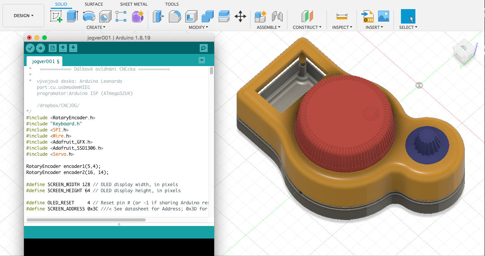

# Mini CNC Jog

## Arduino Pro Micro based USB mini CNC jog remote controler

After some time operating my DIY CNC I realize, that ability to move axies and not loosing eye contact with tool, might by very usefull. So I came up with this.

My idea was just to by able to move axies, chace step size/length and resetting Zero, (may by on/off laser later). But since it is basiccaly programmable kayboard (with 2 rotaryEncoders includes 2 buttons which gives 6 actions if using OneButton Lib ) it offers variety of uses. Here is how I did it.

# CHAPTER I - HARDWARE

Parts list

* Arduino Pro Micro (in my case from [LaskaKit.cz](https://www.laskakit.cz/arduino-leonardo-pro-micro/))
* Rotary Encoder module (in my case from [LaskaKit.cz](https://www.laskakit.cz/rotacni-encoder-s-tlacitkem-a-rc-s-filtrem/))
* OLED Display 0.96" 128x64  (in my case from [LaskaKit.cz](https://www.laskakit.cz/oled-displej-bily-128x64-0-96--i2c/))
* PCB [fooprint/Schemas/IMG/PDG](https://github.com/PetrOdst/mini_cnc_jog/tree/main/PCB)
* 3DPrinted Housing [STL](https://github.com/PetrOdst/mini_cnc_jog/tree/main/3Dmodels)

# CHAPTER II - SOFTWARE

coming soon...

